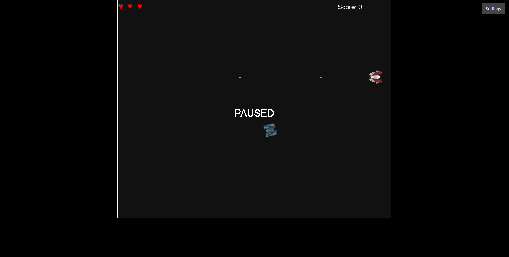

# 🚀 Nova-7: Last Light

**Nova-7: Last Light** is a 2D top-down space shooter game where you play as the last surviving commander of a doomed mission. Fend off alien waves, navigate hostile space, and uncover the fate of your fallen crew.

 <!-- optional image if you have one -->

---

## 🎮 Gameplay

- Pilot your ship with `W`, `A`, `S`, `D`
- Rotate to aim and shoot with `Spacebar`
- Battle against various enemy types: Chasers, Shooters, Crazy Flyers
- Survive as long as you can and increase your score
- Press `P` to pause or resume the game
- Adjust audio settings from the Settings panel
- Listen to the intro story before the action begins

---

## 📦 Features

- Smooth ship controls and physics
- Multiple enemy behaviors and attack patterns
- Health system and visual heart indicators
- Intro story (written + narrated)
- Retro-style visual design and effects
- Responsive audio: SFX and background music
- Simple and expandable game engine (HTML5 + JS)

---

## 🔊 Story (Intro)

> "This is Commander Elias Ward, final survivor of the Nova-7 crew.  
> Earth is gone. Our mission was sabotage. One by one... I watched them die.  
> If you're hearing this—fight back. Make it count."

(Spoken narration included via `intro_narration.mp3`.)

---

## 🛠️ Technologies

- HTML5 Canvas
- Vanilla JavaScript
- CSS for layout and UI
- MP3 audio support

---

## 🚀 Getting Started

To run the game locally:

```bash
git clone https://github.com/TheMalwareChecker-TMC/Nova-7-Last-Light.git
cd Nova-7-Last-Light
open index.html  # or double-click it in your file explorer
